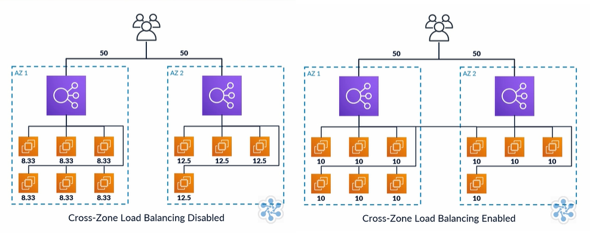

# Compute: AWS Compute Services

### Contents
1. [EC2 - Elastic Compute Cloud](#one)
2. [ECS - Elastic Container Services](#two)
3. [ECR - Elastic Container Registry](#three)
4. [EKS - Elastic Container Services for Kubernetes](#four)
5. [AWS Elastic Beanstalk](#five)
6. [AWS Lambda](#six)
7. [AWS Batch](#seven)
8. [Amazon Sailall](#eight)
9. [Load Balancing](#nine)
10. [EC-2 Auto-Scaling](#ten)

<br/>

---

<br/>

## $EC2$ - $Elastic$ $Compute$ $Cloud$ <a id="one"></a>
An EC2 instance can be broken down into several components:
* Amazon Machine Images (AMIs)
* Instance Types
* Instance Purchasing Options
* Tenancy
* User Data
* Storage Options
* Security

### **Amazon Machine Images**
*These are pre-configured EC2 instances which enable a user to quickly launch an instance using the configuration of the AMI. This is quicker, and means you do not need to install an Operating System, and there are many AMIs available as well as the option to create your own AMI to customise the configurations. Finally, you can purchase AMIs from Amazon Marketplace creared by other users based on your owns needs, and community AMIs are available*

### **Instance Types**
*An instance type defines the size of the instance based on ECUs, VCPUs, Physical Processor, Clock Speed, Memory, Storage, EBS-Optimization, Network Performance, IPV6 compatability, Processor Achitecture, AES-NI Encryption, AVX and Turbo. Instance types are categorized into instance families based on their general need - Micro Instances, General Purpose, Compute Optimized, GPU Instances, FPGA Instances, Memory Optimized, and Storage Optimized being the key families*

### **Instance Purchasing Options**
*EC2 insatances come with several payment plans. They can be purchased on-demand, reserved, scheduled, spot, or as on-demand capacity reservations based on the user's needs. On-demand is used as and when needed, and are billed at a flat-rate paid by the second. Reserved instances are purchased for a set period of time and can be cheaper, but require a minimum period, whereas scheduled instances - whilst also purchased in advance - run at set period rather than consistantly running for the entire time frame. Spot instances work by bidding for unused resources, so there is less stability as they can be removed if someone bids higher at any point, but they can be significantly cheaper as a result. Finally, on-demand capacity reservations reserve capacity enabling a guarentee of certain capacity*

### **Tenancy**
*Shared tenancy will launch an EC2 instance on any available host regardless of what other users are running on that same host, whereas dedicated tenancy will be hosted on hardware that no other user can access - the host is dedicated to that instance, but often are charged at a higher rate. Dedicated hosts are similar to dedicated instances, but offer further control and allows you to host multiple instances on your dedicated host*

### **User Data**
*User data allows you to setup commands to run automatically on boost, such as pulling updates*

### **Storage Options**
*Storage requirements are requested when you first setup the EC2 instance and can be persistant or ephemeral (tempoary). Peristance storage is available by attaching EBS volumes and are seperate from the instance, logically attached through AWS network - similar to an external harddisk - and can be created in difference sized. Empheral storage is physically attached to the instance - similar to a laptop's built-in harddrive - and when the instance is stopped, all data ceases to exists and cannot be retained without the instance running and cannot be detatched*

### **Security**
*A security group is an instance-level firewall and setup when creating the instance using a key-pair. This means there is a public key and private key which is used to securily access and transfer data; AWS keeps the public key and the user is responsible for the private key. The same key-pair can be used on multiple instances. It is the users responsibility to update and maintain OS updates for security purposes*

<br/>

---

<br/>

## $ECS$ - $Elastic$ $Container$ $Services$  <a id="two"></a>
&nbsp; ECS allows a user to run Docker-enabled applications which are packaged as a cluster of EC2 instances. It reduces the need for management of the system by passing the burden to AWS through AWS Fargate. As docker containers arew decoupled from the OS to improve portability, and AWS Fargate configures and manages these containers with an EC2 instance. No management or monitoring software is needed, and when launching the cluster you can choose the Fargate launch instead of the EC2 launch. This is easier to manage, but does reduce customisability. <br/>
&nbsp; An Amazon ECS cluster is comprised of many EC2 instances, which provide functionality such as securty, autoscaling, and elastic load-balancing, and operate in the same way as an EC2 instance. The clusters act as a resource pool and are dynamically scalable, and multiple instance types can be used within the cluster, although they cannot spand multiple regions. 

<br/>

---

<br/>

## $ECR$ - $Elastic$ $Container$ $Registry$  <a id="three"></a>
&nbsp; ECR is linked with EC2, and provides a secure location to storage an manage docker images whilst being a fully-managed service so provisoning of infrastructure is not needed to create the registry. ECR consists of several components:
### **Registry**
*Allows you to host and store your docker images and create image repositories. Your account will have read and write access by default, and access can be customised using IAM policies and repository policies. The docker client must be authenticated as an AWS user before it can access the registry, which is done using an authorization token*

### **Authorization Token**
*The get-login command can be used to begin the authorization process:*
```
aws ecr get-login-password --region <your-region> --no-include-email
```
*This then produces an output which is the docker login command, which when used produces an auth token which can be used within 12 hours to access the registry:*
```
docker login -u AWS -p <password>
https://<aws_accound_id>.dkr.ecr.<your-region>.amazonaws.com
```

### **Repository**
*This is an object or objects within the registry which allows for the grouping together of docker images in a secure and logical manner. Multiple repositories can exist within the registry, and permissions can be set using IAM policies or repository policies. Registry policies are as follows:*
1. ``` AmazonEC2ContainerRegistryFullAccess ```
2. ``` AmazonEC2ContainerRegistryPowerUser ```
3. ``` AmazonEC2ContainerRegistryReadOnly ```

*Policies are resource-based so a principal must be added to determine permissions and a user can then access using the ```ecr:GetAuthorizationToken``` API call*

### **Image**
*Images can then be stored and pulled from ECR using the docker push and docker pull commands*


<br/>

---

<br/>

## $EKS$ - $Elastic$ $Container$ $Service$ $for$ $Kubernetes$  <a id="four"></a>
&nbsp; Kubernetes is an open-source tool designed for operating, automating, deploying, and scaling containerized applications. EKS provides a managed service for handling the running and management of Kubernetes across AWS infrastructure, meaning the user only needs to manage/control the worker nodes. The Kubernetes control plane is used for management, made up of many APIs and components, by scheduling containers onto nodes via a decision process and tracks the state of the objects - this is all managed with AWS so provisioning and monitoring does not need to be done by the end user. The worker nodes make up the cluster in Kubernetes, and is a worker machine which can be run on-demand with AWS. Once provisioned, work nodes can connect to EKS. <br/>
### **Using EKS**
1. Create an EKS Service Role: configure and create an IAM service role allowing provison and configuation
2. Create an EKS Cluster VPC: create and run a CloudFormation stack which will configure a new VPC for EKS
3. Install KuberCtl and AWS-IAM-Authenticator: Kuberctl is a command line Kubernetes utility, and AWS-IAM-Authenticator enables authorization
4. Create EKS Cluster: use the EKS console to create the cluster based on the VPC created earlier
5. Configure KuberCtl for EKS: use the ```ubdate-kubeconfig``` command in the AWS CLI to create a configuration file
6. Provision and Configure Worker Nodes: create and configure the nodes using CloudFormation
7. Configure Worker Nodes for EKS Cluster: configure the nodes to join the EKS cluster created ready to deploy

<br/>

---

<br/>

## $AWS$ $Elastic$ $Beanstalk$  <a id="five"></a>
&nbsp; AWS Elastic Beanstalk is a service managed by AWS which enables uploading of web code to then be automatically provisioned and deployed, making the web application operational and deployed. This includes use of other AWS resources, and automates and simplifies the process making it easier to provision, deploy, monitor and scale web applications as the responsibility is passed to AWS. Beanstalk is free to use, and works with a variety of languages, but users will be charged for the use of resources it provisions. <br/>
&nbsp; The **application version** is a specific reference to a section of deployable code and usually points to S3 simple storage where the code may reside. An **environment** refers to a deployed application version with resources provisioned and configured by beanstalk, and the application is optional within the environment, which refers to *all* resources created by Elastic Beanstalk. The environment can then be amended with **environment configurations** which dictate how an environment will provision resources and how resources will behave, and the **environment tier** determines if the application will be run in a web-server environment (if it handles HTTP requests) or a worker environment (such as if it pulls data from an SQS queue instead). A **configuration tempalte** can be used to help configure the environment, and the **platform** references the collective components required to build the application upon such as OS and programming language. <br/>
&nbsp; The **application** itself within Beanstalk is the collection of different elements (such as environment and configurations), and is deployed across an envionment tier based on need which will provison various AWS resources based on the needs and uses of the application. As Beanstalk is designed to be simple and easy to use, the process for doing so is broken into four steps: Create Application, Upload Version, Launch Environment, Manage Environment. AWS takes care of most of the work during this process.

<br/>

---

<br/>

## $AWS$ $Lambda$  <a id="six"></a>
&nbsp; AWS Lambda is a serverless compute service allowing for the running of code without the need to provision and manage an EC2 instance, as AWS manages the compute resource. Resources will be started, stopped, and maintained as needed by AWS, and is considered serveless as the user does not need to worry about the compute resources needed for managing the application. AWS Lambda only charges whilst it is running and can be highly cost-effective. There are four steps to how AWS Lambda works:
### **Coding**
*Code can be uploaded to AWS Lambda or written within the provided code editor. Lambda supports Node.js, Java, C#, Python, Go, PowerShell, and Ruby*

### **Configure Functions**
*Lambda Functions can then be configured to execute scripts upon certain triggers from certain event sources, such as an object being uploaded to an S3 Bucket*

### **Computing**
*Once triggered, AWS lambda will execute the code as per the function using only the required compute power for that specific operation as defined*

### **Costing**
*AWS records the compute time in milliseconds and the quantity of Lambda Functions which have run so as to calculate the cost to the end user*

&nbsp; AWS Lambda is made up of many components, with several being considered key. The **lambda function** is compiled based on the users code and determines what code to run when which specific events are triggered, and the **event source** is the trigger for the lambda function to execute code comprised on AWS services (such as S3 Bucket). The event source will have a specific **trigger** defined which, once it has occured, tells lambda to execute the function - for example S3 may be the event source, and uploading data may be the specific trigger. **Downstream resources** may also be required for the execution of a function, and are not sources for the function but called upon when the function executes. When troubleshooting a lambda function, **log streams** can be used as these are essencially an output stream of events all related to that specific function. <br/>
&nbsp; Creating lambda functions may consist of selecting a blueprint/template lambda function which is suitable for your purpose and even further customising it. Triggers can then be configured for this function and defined clearly, and further configuration can be complete including defining resource paramters and uploading code to execute. AWS is highly-scalable, and easy to scale, making it a fantastic option to consider for serverless services.

<br/>

---

<br/>

## $AWS$ $Batch$  <a id="seven"></a>
&nbsp; Batch is used to manage and run batch computing workload in AWS, which is a specialist for of computing where vast amounts of compute power is needed across many clusters of resources to complete the batch processing and execution of a series of tasks. This can be difficult to maintain and costly outside of the cloud, but AWS Batch allows for the seamless creation of compute resources and is highly scalable to optimize distribution of workloads. AWS manages the provison, maintenance, and managing so no software needs to be installed. Batch is made up of five components:
### **1. JOBS**
*Jobs are a unit of work that needs to be run using AWS Batch such as an executable file, a shell script, or an application. Any job at any one time can be in any state*
### **2. JOB DEFINITION**
*Job definitions define the parameters for the jobs themselves and dictate their execution and configuration (such as how many CPUs to use)*
### **3. JOB QUQUES**
*Job queues are used to schedule jobs, and a user could have many queues with different priorities as well as on-demand and spot instances*
### **4. JOB SCHEDULING**
*The job scheduler determines when a job should be run and from which compute environment, generally using a FI-FO rule as well as looking at the configured job queues*
### **5. COMPUTE ENVIRONEMENT**
*Compute environments refers to the specific environment in which the job is carried out, and contains the resources needed. It could be managed (handled by AWS) or unmanaged (handled by the user)*

<br/>

---

<br/>

## $Amazon$ $Lightsail$  <a id="eight"></a>
&nbsp; Amazon Lightsail is a compute service not disimilar from EC2, and is in essence a Virtual Private Server (VPS) backed by AWS infrasturcture. It is designed to be simple and quick, and so is ideal for small-scale use by small businesses or individual users. Commonly, Lightsail is used for host simple websites such as blogs, and multiple lightsail instances can be run together and communicate with one another as well as other AWS resources. <br/>
&nbsp; Amazon Lightsail is easy to configure and deploy. Simply choose to create an instance, select the region and availbility zone as required, select the platform, and optionally select a blueprint for the service such as Wordpress or Node.JS blueprints, or just use the OS only. A launch script can also optionally be setup, and there is a default key-pair which a user can change if they wish. The instance plan chosen then determines resources used and cost to the end user and is simple to understand and tailor to user need. Lastly, an instance name is required, and tags can optionally be added to identify the instance. The VPS is now configured and ready to go, with easy access to management options such as connecting to the instance, storage, and networking.

<br/>

---

<br/>

## $Elastic$ $Load$ $Balancing$  <a id="nine"></a>
### **OVERVIEW**
&nbsp; The main function of an Elastic Load Balancer (ELB) is to manage the flow of inbound requests by distributing requests across the resources of the target resource group. These targets could be containers, EC2 instances, Lambda Functions, or many other options and could be situated across one or multiple availability zones. For example, a single instance application could experience a failure taking the serve down so users cannot access it, or it could experience a sudden spike is user traffic which it is not able to handle. ELBs are then used to balance traffic across instances and improve availability to the end users, as ELBs can divert traffic should an instance fail, and can distribute traffic evenly during a sudden spike. <br/>
&nbsp; ELB is managed by AWS, and is auto-scaling as it is elastic, which removes need for manual managing. AWS has three types of load balancer available: Application, Network, and Classic (discussed further below), and is made of several components. A **listener** defines how inbound traffic is routed to target groups based on ports and conditions, a **target group** is a group of resources which the ELB routes requests to, and **rules** are associated with listeners to determine how incoming requests are handled. ELBs must comprise of at least one listener, rule, and component, but can branch out to as many as needed. In general, an if statement represents the condition and a then statement represents the action. E.g.:
```
IF
Source IP is 10.0.1.0/24
HTTP method is put

THEN
Forward to Group_One
```

&nbsp; Additionally, an ELB uses **health checks** performed against resources by contacting the target resources and receiving a response, and if no response is recieved within a set timeout period then the resource is marked as unhealthy and no traffic is directed there. ELBs can also be **internal** or **internet-facing** where the latter's nodes are accessable via the internet and have a public DNS name resolving to a public IP address, as well as an internal IP address; the former only has an internal IP address so can only serve requests made by the VPS itself. ELB **nodes** exist within each availbilty zone the ELB is configured in and enabled routing of traffic to that availability zone, and traffic cannot be routed without a node configured, whereas **cross-zone load-balancing** can be used to evenly distribute traffic across zones, ensuring zones with a smaller number of instances don't end up taking on a larger amount of traffic, as shown in the diagram below:




### **SSL SERVER CERTIFICATES**
&nbsp; Service Certificates are used with ELB - specifically Application Load Balancers (ALB) - when HTTPS encrypted protocol is needed to be used as a listener. To allow an ALB to recieve encrypted traffic over HTTPS a server certificate and security policy must be configured, and Secure Sockets Layer (SSL) is a security cryptographic protocol, often referred to interchangabley with Transfer Layer Security (TLS) when discussing ALB certificates. <br/>
&nbsp; The server certificate, X.509, is a digital ID provisioned with a certificate authority (such as AWC Certificate Manager) and is used to terminate encrypted connections, decrypt the request, and then forward to the appropriate resource target group. When configuring HTTPS as a listender, AWS will prompt the user to either choose an ACM certificate, upload an ACM certificate, choose an IAM (third-party) certificate, or upload an IAM certificate; using IAM is only advised if ACM is not available in your region.

### **APPLICATION LOAD BALANCERS**
&nbsp; The Application Load Balancer (ALB) operates at layer 7 - the application layer - of the OSI model, which serves as an interface for users and application processes accessing network services. ALB is advised when a user needs flexible feature sets for web applications, and provides advanced routing and visability for such architecture, including microservices and containers. <br/>
#### *Utilizing an ALB:*
**1. Setup Taqrget Groups** in the EC2 console by selecting target groups within the manager and clicking 'Create Target Group'. The group will need a name, type (Instance, IP, or Lambda Function), protocol, port, VPC, and some health-check settings (path and protocol) configured, and there are further configuration settings for health checks if desired. 

**2. Create Targets** by entering the targets tab of the target group in EC2 and aelecting edit, then selecting the running instance(s)/IP(s)/function(s) you wish to associate with that target group and clicking save.

**3. Create the ALB** by choosing load balancers within the EC2 console and clicking 'Create Load Balancer' and choosing Application Load Balancer. The ALB setup will require a name, scheme (internet-facing vs internal), IP address type for the basic configuration. The protocol for at least one Listen will need to be added, as well as availability zone(s) configured for any and all VPCs. Optionally, tags can be added. 

**4. ALB Security** settings is the next step before the ALB is created, and can only be configured if HTTPS was chosen. Security Groups, however, will need to be assigned to the load balancer and can be created or selected from a previous group.

**5. Further Configuration** in the setup include configuring the routing by selecting the target group created earlier and registering the targets associated with the group which should be automatically selecting from the target group. Once the settings are reviewed, the ALB is created and will start provisioning, and is ready for use once provisioning is complete. Some rules cannot be changed, but new rules can later be added to the listener to better meet user needs.

### **NETWORK LOAD BALANCERS**
&nbsp; Network Load Balancers (NLB) are not disimilar to ALBs, however NLBs work at layer four of the OSI model - transport layer - rather than the application level. This means requests are balanced based on the TCP protocol rather than HTTP protocols, and the NLB can process millions of these requests per second. NLBs also have the option to enable or disable cross-zone load balancing, and configuration follows the same process as an ALB with options selected based on the specific use of the NLB.

### **CLASSIC LOAD BALANCERS**
&nbsp; Classic Load Balancers (CLB) supports TCP, SSL/TLS, HTTP and HTTPS protocols, but doesn't offer as wide a range of features. CLB is based of the AWS EC2-Classic platform which is depricated now and no longer available to new users. CLB supports EC2-Classic still, as well as having support for TCP and SSL listeners and sticky sessions with application-generated cookies. However, ALB or NLB is still recommended over CLB, although is not disimilar in function or configuration to the aforementioned and setup follows the same process.


<br/>

---

<br/>

## $EC2$ $Auto-Scaling$  <a id="ten"></a>
### **OVERVIEW**
&nbsp; Auto-scaling refers to the ability of automatic increasing or decreasing of available resources, adapting automatically to needs of the service. EC2-Autoscaling can respond to changes such as demands in requests by provisioning further resources such as a second instance, and can then stop that instance when demand goes down to optimize costing of compute resources. 

### **COMPONENTS**
Several components make up the AWS EC2-Auto-Scaling service, including:

#### **LAUNCH CONFIGURATION**
*The first step of EC2 autoscaling involves creating a launch configuration or a launch template. This defines how EC2 builds new instances by answering questions such as which AMI image to use, which instance type to select, should public IP addresses be used, and is any user data required on first boot. A launch template follows the same stucture as manual setup for an EC2 instance, and exists so the autoscaler knows how to create the instance(s) when needed. A launch template however has a few additional options and is a little more simplistic compared to a launch configuration.*

#### **AUTOSCALING GROUP**
*The second step of EC2-Autoscaling setup is creating an autoscaling group. An autoscaling group defines the desired capacity and limitations of the group by using scaling policies such as where to scale resources (e.g., availability zones). Auto-scaling groups, like launch configs, can be set up inside the AWS EC2 console under auto-scaling, and can be based on a previously created launch template or launch configuration. The launch template/config can be adhered to or amended, and then the autoscaling policies can be setup. Additionally, an existing auto-scaling group can be configured to work with a new load balancer if needed. Using scaling policies must be selected during setup to enable to autoscaling group to scale up resources using scaling policies. The auto-scaler will respond to triggers and follow user-defined rules to then send requests to create a new instance using the launch template/config.*


### **AUTO-SCALING & ELB**
&nbsp; Elastic Load Balancers (ELB) and Autoscaling (AS) can be used together to better optimize and manage EC2 infrastructure. With ELBs distributing traffic as needed to target groups, and AS creatng new resources when demand is higher, it makes sense that they work in a complimentary fashion. An ELB can be attached to an AS group and will automatically distribute traffic to resources in that group, and the ELB needs to be associated with the autoscaling group. <br/>
&nbsp; To associate an ELB with an AS, open the EC2 console and enter the AS settings where load balancer and target group fields should be visible. Users can then edit the details of their AS group, and add the load balancer - ALB/NLB should be associated with target groups and so selected within the Target Groups field, whereas CLB should be associated with classic load balancers and so selected within the Classic Load Balancers field. This enabled the AS group to recognise and be associated with the resources in the ELB, allowing both to work together.