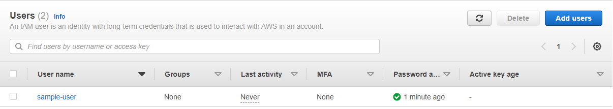
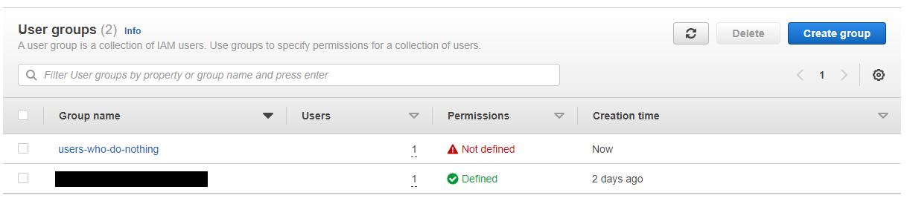
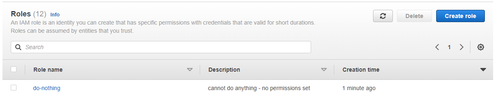
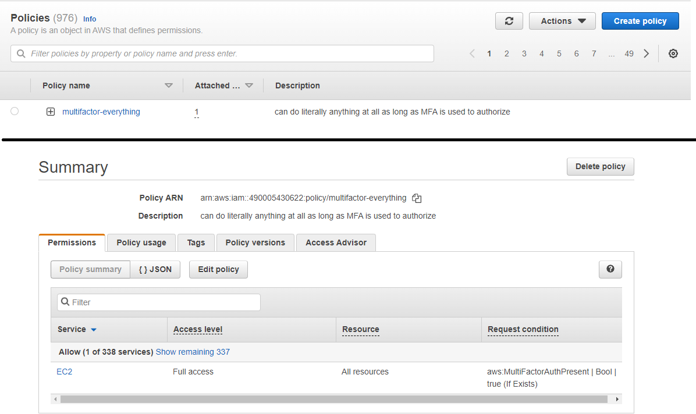

# Security and Compliance <a id="top"></a>

### Contents
1. [AWS Artifact](#one)
2. [IAM: Access Management](#two)
3. [IAM: Users](#three)
4. [IAM: Groups and Roles](#four)
5. [IAM: Permissions](#five)
6. [Trusted Advisor](#six)
7. [AWS Organisations](#seven)
8. [Firewalls and Shields](#eight)
9. [Other Services](#nine)


<br/>

---

<br/>

## $Introduction$ <a id="one"></a>
&nbsp; AWS Artifact is a portal which provides users with security and compliance reports, as well as the ability to download, view, approve, or reject legal agreements with AWS. Users may need to provide evidence of compliance for audit reasons, or perhaps just want to better understand their responsibilities and regulatory requirements, and AWS Artifact enables this and can be accessed from the AWS Console. <br/>
&nbsp; **AWS Artifact Reports** consists of auditor-issues reports, ISO certifications, PCI, and SOC reports amongst others. Known as audit artifcats, these reports can be sharely easily with audiotrs using IAM. <br/>
&nbsp; **AWS Artifact Agreements** enables a user to view and share legally binding agreements between them and AWS pertaining to security and compliance measures, and can be applied at individual account level or to the AWS organisation. For example, here is where the Business Associate Addendum (BAA) agreement can be found, which governs usage of AWS services and Personal Health Information (PHI). 
<br/>

<div style="text-align:right;">
<a href="#top">Back To Top</a>
</div>

---

<br/>

## $IAM:$ $Access$ $Management$ <a id="two"></a>
&nbsp; Identity and Access Management (IAM) is a crucial tool for AWS security and compliance management. AWS usernames are required to authenticate an AWS account, which is managed in two stages: defining the user (e.g., username), and verification (such as a password). Authority then determines what an identity can access within an AWS account, such as users permissions to access certain resources. <br/>
&nbsp; IAM works to maintain security of who (or what) can access components. IAM enables users to setup the strictness of access control and authorization, the processes and policies for identities (e.g., password policies), and if MFA is needed. It uses various features to achieve this:
### **Dashboard**
*The initial landing page of IAM. This includes the IAM user sign-in link to be distributed to users to enable them to log in, as well as IAM resources overview (including number of Users, Groups, Policies, Roles, and Identity providers configured), and a list of IAM best practice which are recommended by AWS.*

### **Access Management**
*Access management consists of several components: Users, Groups, Roles, Policies, and Identity Providers. User objects represent an identity, such as a real person or an application, identified by a resource name. Groups are objects like users, but instead of authenticating, they authorize users within the group to access various resources. Roles operate in a similar way to user objects, allowing identities to access resources and determining permissions, however roles don't define a single person, instead an identity or service which needs temporary access permissions, and don't have passwords. Policies in IAM are JSON documents which determine what can and cannot be accessed by attaching them to users, groups, and/or roles. AWS prefines several managed policies which can be applied from a library to users, whereas inline policies must be explitically written for a user or role. Finally, identity providers enable federated access - this is where credentials external to AWS can be used as a means of authentication. For example, establishing a trust between your AWS account and Google account, allowing the Google account to authenticate the user. Additionally, password policies can be setup in access management, which determine the requirements for users passwords, and applies to all IAM users within the account, or security token service (STS) can be used to create a temporary set of credentials to provide limited access and control.*

### **Access Reports**
*Access reports consists of the Access Analyser, Credential Report, Organizational Activity Reports, and Service Control Policies. The first item, access analyser, is used to generate findings when resource allows access from outside the zone of trust; if any resource allows external access, it will be flagged here to support with security. Creditial reports allows the account to generate and download a report of all IAM users and their credientials. Organizational activity allows users to select an organizational unit or account and view its service activity and monitor activity of users and roles within it. Finally, service control policies lists any and all service control policies associated with any users or roles; service control policies (SCP) do not grant permissions, but are used with AWS organizations to implement boundaries and permissions to AWS accounts.*
<br/>

<div style="text-align:right;">
<a href="#top">Back To Top</a>
</div>

---

<br/>

## $IAM:$ $Users$ <a id="three"></a>
&nbsp; Users, as aforementioned, are objects representing identities and applications using AWS resources within an account. Various details can be set for users, and the IAM Users dashboard provides an overview of activity, raises concerns, and details about that users. This can help ensure that no users show any security risk concerns (such as passwords being weak or out of date), and ensure the appropriate policies and permisions are applied and up-to-date, or even delete unsused IAM user accounts as per best practice. Which details are shown on the dashboard can be configured in IAM, the default details are demonstrated in the image below for user 'sample-user' with no permissions set.

<br/>

<div style="text-align:right;">
<a href="#top">Back To Top</a>
</div>

---

<br/>

## $IAM:$ $Groups$ & $Roles$ <a id="four"></a>
&nbsp; Groups define collections of types of users with shared permissions or access policies. For example, it could be admin staff, security engineers, or collections of EC2 users. Groups can be created and then have users added to them, with permissions defined which apply to the whole user group. The image below shows the users-who-do-nothing temporary group created with no permissins, as well as the [REDACTED] user-group which does have permissions defined.

&nbsp; Roles can also be used to determine permissions, but as aforementioned these are applied to applications or resources, storing credentials which enable the resource to access the other resources or services it needs to use. For example, defining a role to an EC2 instance to determine it is able to access an S3 bucket without needing to store local credentials. The image below shows an example of a role applicable to EC2 instances which does not permit them to do anything or interact with other services. AWS also provides several pre-defined roles for a variety of services, including quickstart roles and read-only permissions. 

<br/>

<div style="text-align:right;">
<a href="#top">Back To Top</a>
</div>

---

<br/>

## $IAM:$ $Permissions$ <a id="five"></a>
&nbsp; Permissions can also be set within IAM using policies, which determine what can be done by which users under which conditions, and are attached to users. These could be pre-defined by AWS, can be managed and applicable easily to multiple users, or be inline and customer to specific users. The image below shows an example of a policy created allowing the sample-user account full access to all resources within EC2 as long as MFA is used to authenticate the user. Whilst this is a simple policy, there are four policy types within AWS.


### **Identity-based**
*Associated with an identity such as a user, user-group, or role, and can be managed or inline.*

### **Permision Boundaries**
*Associated with roles or users, but don't grant permissions: they define the maximum level of permission that could be granted.*

### **Resource-based**
*Associated with a resource, such as a role-trust policy which defines the principle which can assume the role.*

### **Organization Service Control Policies**
*Similar to permission boundaries, but associated with an AWS acocunt or Organizational Unit rather than individual users or resources.*
<br/>
&nbsp; IAM policies additionally follow a defined JSON format for their structure, which can be broken down as follows: <br/>
```
{
    Version : yyyy-mm-dd,
```
> specifies the policy language version and syntax used
```
    Statement : [
```
> refers to the main element of the body, includingaction and resource definitions
```
        {
            sid : random123897string,
```
> optional, statement ID, must be unique
```
            Effect : Allow,
```
> whether the policy is allowing or denying the actions in the statement
```
            Principal : AWS : arn:for:user,
> only applicable to resource policies; specifies the user/role/account it applies to
```
            Action : do thing,
> the action which will be allowed or denied, may be a specific action or a service with an * to apply the policy to
```
            Resource : to thing,
```
> the resource which the policy applies to, using ARN: arn:partition:service:region:account:resource
```
            Condition : [
                IpAddress : {
                    aws:SourceIp : 12.3.4.5/16
                    }
                ]
            ]
        }
    ]
}
```
> optional; may be permitted IP address(es) or MFA requirement

&nbsp; From this, it is clear the example given above is of an identity, which can be confirmed in that the policy JSON document does not have a principal paremter (required for resource policies), and sets the actual permissions rather than the bounds of permissions (such as permission bounds or OSC policies).
<br/>
<div style="text-align:right;">
<a href="#top">Back To Top</a>
</div>

---

<br/>


## $Trusted$ $Advisor$ <a id="six"></a>
&nbsp; 
<br/>

<div style="text-align:right;">
<a href="#top">Back To Top</a>
</div>

---

<br/>


## $AWS$ $Organisations$ <a id="seven"></a>
&nbsp; 
<br/>

<div style="text-align:right;">
<a href="#top">Back To Top</a>
</div>

---

<br/>


## $Firewalls$ & $Shields$ <a id="eight"></a>
&nbsp; 
<br/>

<div style="text-align:right;">
<a href="#top">Back To Top</a>
</div>

---

<br/>


## $Other$ $Services$ <a id="nine"></a>
&nbsp; 
<br/>

<div style="text-align:right;">
<a href="#top">Back To Top</a>
</div>

---

<br/>
