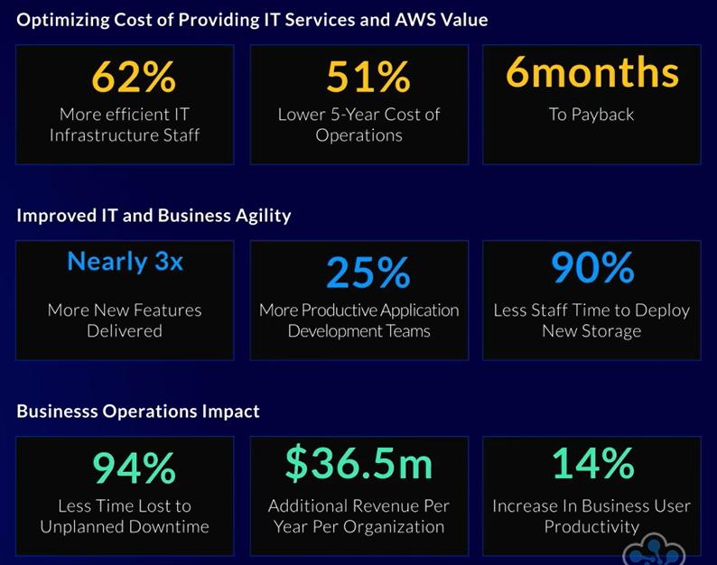

# Billing, Pricing, and Support 

### Contents
1. [Cloud Economics](#one)
2. [AWS Management](#two)
3. [AWS Cost Management: Tools](#three)
4. [AWS Cost Management: Tagging](#four)

 

---

 

## $Cloud$ $Economics$ 
&nbsp; Cost optimization is vital for all businesses, and the Clouds utility-based costing has enabled signifcant enhancements in this area. Examples of reductions in cost include a lower Total Cost of Ownership (TCO), Staff Productivity, Operational Resilience, and Business Agility. Several statistic on the cost optimization of AWS Cloud are shown below:

&nbsp; AWS helps achieve this using the **Five Pillars of Cost Optimization**
* Right-Sizing Your Instance
* Increase Elasticity
* Pick the Right Pricing Model
* Match Usage to Storage Costs
* Measuring and Monitoring

 

<a href="#top">Back To Top</a>

---

 

## $AWS$ $Managment$ 
&nbsp; The AWS Pricing Calculator can be used to assist users in finding the best possible pricing option for them and their needs. Users can simply input the resources/services they wish to use, choose their region and set variables such as spikes in traffic, workload days, and instances alongside many more specifics. The pricing calculator will then estimate the average monthly cost, and enable the user to explore varius options and see how the estimate cost may differ.  
&nbsp; The AWS Well-Architected Framework refers to the collection of best practices and policies based on Operational Excellence, Security, Reliability, Performance Efficiency, and Cost Optimisation. This guide provides insight from data gathered by AWS and can serve as a powerful tool for enabling businesses and users to structure their approach. The core principals of each of these five pillars are listed below.  

**OPERATIONAL EXCELLENCE**
1. Operations-as-code
2. Frequent, but small and reversable, changes#
3. Evolve procedures alongside the workload
4. Failure prevention
5. Learning from operational failures

**SECURITY**
1. Implementation of a strong identity foundation
2. Traceability
3. Apply security at all levels
4. Security by automation
5. Data protection
6. Access
7. Incident preparation

**RELIABILITY**
1. Automatic recovery
2. Test recovery procedures
3. Horizontal scaling for better availability
4. Stop guessing capacity
5. Manage changes in automation

**PERFORMANCE EFFICIENCY**
1. Make use of advanced technologies
2. Global in minutes
3. Serverless architecture
4. Experiment more
5. Know the options to make the right choice

**COST OPTIMISATION**
1. Implement cloud financial management
2. Adopt a consumption model
3. Measure overall efficiency
4. Stop spending money on data center operations
5. Analyze and attribute expenses

 

<a href="#top">Back To Top</a>

---

 

## $AWS$ $Cost$ $Management:$ $Tools$ 
&nbsp; The AWS Billing tool enables users to get a clear overview of their current costs and reports. The resources and services which are costing the most are known as Cost Drivers, and are a good place to start with cost analysis. This analysis enables better insight into if there is any wasteful spending, or to review options of cost optimisation. Additionally, AWS uses credits which are given out for a variety of reasons (publishing skills to Alexa for example) which can be spent instead of money to operate services.  
&nbsp; AWS additionally provides the Cost Explorer, which is designed to assist with gathering and analysing information about costs and spending with AWS. The Cost Explorer will display costs across time periods, with helpful graphs and charts, usage patterns, and identify cost drivers. The cost explorer includes many features and views to enable a user to explore the specific data they need and help manage their business costs.  
&nbsp; Finally, AWS Cost Management tools offers reports, including Cost and Usage Reports, and the Budgets tool. Views within the management console can be saved as reports and will be stored in the reports tab, although the Cost Utilization Report (CUR) is exported as a CSV file and cna be incredible large as it covers such a wide range of data. Time granularity can be as precise an hourly, and reports can be integrated with tools such as Athena and QuickSight. AWS Budgets can be used to help monitor spending, including through automated alerts related to AWS usage. If costs start reaching a threshold, AWS will notify users. However, budgets can be based on cost, usage, reservation, or savings plans. The monthly budget as well as additional parameters and variability across months can be set, and AWS will generate a budget based on the details given.
 

<a href="#top">Back To Top</a>

---

 

## $AWs$ $Cost$ $Management:$ $Tagging$ 
&nbsp; Tags are a powerful tool within AWS, and can be applied to any resource. One use of them is within budgetting and finance management, and use a key-value structure. Tags can be used to associate resources with traditional financial reports, and can provide further insight into costs by providing further detail to your bill or CUR. Best practices for AWS Cost Management Tagging include:
* Keep tags consistant and simple
* Tag as resources are deployed
* Align to cost allocation strategy
* Tag everything
* Find purpose for each tag
* Limit number of tags used
* Automate tag management
* Audit and maintain tags
&nbsp; AWS also offers several AWS-Generated Cost Allocation tags, which are used for cost analysis and visualisation, and User-Generated tags can also be used to customise and provide business-specific details. Cost Allocation tags are powerful for the cost management console, and AWS-Generated tags assists with the management and implementation of this.
 

<a href="#top">Back To Top</a>

---